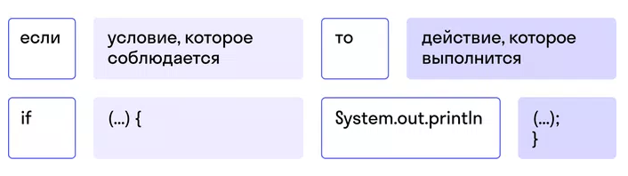

## Задача 1
С помощью условного оператора напишите программу, которая выводит в консоль:
сообщение о том, что человеку 18 или больше лет;
сообщение, что возраст совершеннолетия еще не наступил и нужно немного подождать.
При выполнении каждого условия программа должна выводить в консоль сообщение в формате: «Если возраст человека равен …, то (вывести в зависимости от результата) он совершеннолетний / он не достиг совершеннолетия, нужно немного подождать».

#### Критерии оценки

Инициализировали переменные.
Имя переменных отражает данные, которые они содержат.
Параметры условного оператора решают задание.
Решение задачи выводится в консоль.

#### Подсказка

## Задача 2
Человек одевается в зависимости от температуры воздуха. Напишите программу, которая выводит сообщение:

«На улице холодно, нужно надеть шапку» — если температура ниже 5 градусов.
«Сегодня тепло, можно идти без шапки» — если температура воздуха 5 градусов и выше.
При выполнении каждого условия выведите в консоль: «На улице … градусов, (вывести в зависимости от результата) нужно надеть шапку / можно идти без шапки».

#### Критерии оценки

Инициализировали переменные.
Имя переменных отражает данные, которые они содержат.
Параметры условного оператора решают задание.
Решение задачи выводится в консоль.

## Задача 3
За превышение скорости водителю могут выписать штраф. Напишите программу, которая сообщает водителю о том, что:
скорость превышена, если она больше 60 км/ч;
превышения скорости нет, если она равна 60 км/ч и меньше
При выполнении каждого условия программа должна выводить такое сообщение: «Если скорость …, то (вывести в зависимости от результата) придется заплатить штраф / можно ездить спокойно».
